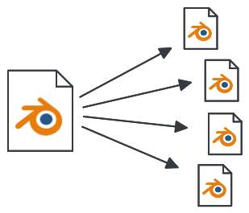

# Blender Takes



A workflow for arbitrary variations (_takes_) from a single Blender file.

## What is this?

The output of a single Blender file can be many things:

- rendered image
- asset
- simulation
- ...

Usually it is necessary to create variations of these outputs:

- rendered image
  - different object states (visibilities, holdouts)
  - backgrounds
  - different materials
  - additional isolated lights
  - varied render settings (preview/production)
  - ...
- asset
  - low/high poly
  - sliced animation geometry and final render geometry
  - rendered asset turntables from different viewing angles
  - variations of procedurally generated assets
  - ...
- simulation
  - wedges: varied seeds to test simulation settings
  - ...

This workflow uses a Blender file as a single source of truth to create consistent output repeatedly.

Almost everything in Blender can be controlled with Python. Variations on a scene are described with Python snippets. These snippets are run on the scene from the command-line and the result is saved in a new blender file.

## Why

Especially in Visual-Effects, rendered output (_passes_) from the computergraphics-department is layered in _compositing_ to create the final image.
During compositing, new passes might be requested.

The list of specialised rendered output from the same scene grows.

On top of that, artistic changes might be requested by supervisors or clients:
e.g. a change in camera-animation can happen at any time and affects all generated output.

Ideally, you want to implement this change once in one place.

All output that was created up to now should then be generated again, programmatically.

## How does it work

Takes are described as Python functions inside a text data-block in the Blender file.
These functions are never called from within the text data-block, so the changes are not accidentally applied.
Instead, a command-line script executes the takes on the Blender file and saves the result as a new Blender file.

A basic definition of takes in the work-file could look like this:

```py
import bpy

def take_cycles():
    bpy.context.scene.render.engine="CYCLES"

def take_eevee():
    bpy.context.scene.render.engine ="BLENDER_EEVEE_NEXT"
    bpy.context.scene.frame_start = 1200
    bpy.context.scene.frame_end= 1300
```

From the command-line, a script (`takes.py`) is run on the file with specified take-names.
This runs the functions and saves a blender file for each take:

```sh
blender --background --factory-startup workfile.blend --python takes.py -- take_cycles take_eevee
```

The generated files can then be used for rendering.

## Run the demo

Clone this repo, open the folder in the command-line and run:

```sh
# Linux
blender --background --factory-startup demo.blend --python takes.py -- hero allCubesDark
```

The demo file uses an external script `utils.py` with helper functions.

The script will create a folder `./output/demo/` with two Blender files:
`demo.hero.blend` and `demo.allCubesDark.blend`.

These files are used for rendering, not for actual work! Every change must be applied to the source file from which the output can be re-generated.

## Best Practices

### Use Collections / Don't operate on objects directly

### Hide all first, then show only what needs to be rendered

```py
def take_beauty():
    hide_all()
    show(["asset1", "lights"])
```

This ensures the produced render is not messed up by objects that have been added to the scene.

### Inherit a variation

Takes can be inherited by simply calling other takes or utility functions:

```python
def preview_settings():
    bpy.context.scene.render.resolution_percentage = 50
    bpy.context.scene.cycles.samples = 100

def take_beauty():
    preview_settings() # call another take or utility function
    hide_all()
    show(["asset1", "lights"])
```

### A take/variation is not supposed to be run inside the Blender-file

Takes can be destructive: data-blocks, like objects, can be deleted to optimize the final output.
Therefore, you do not want to run a take in the workfile!
